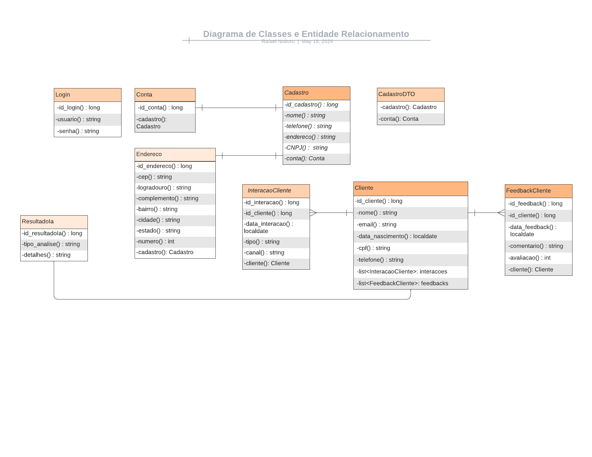

# IaFuture

API do projeto IaFuture - Software que controla resultados de análises feitas por IA

# Representantes 

- Gabriel Ortiz Oliva Gil - RM: 98642 – 2TDSPK
- Rafael Noboru Watanabe Nasaha - RM:99948 – 2TDSPK
- João Pedro Kraide Máximo - RM:550974 – 2TDSPK
- Matheus de Andrade Ferreira - RM:99375 – 2TDSPK
- Larissa Pereira Biusse - RM:551062 - 2TDSPK

-> A atividade foi realizada pelo aluno Rafael Noboru dentro de um período de duas semanas, iniciado no dia 06/05/24.

# Como rodar a aplicação

- Tenha a extensão de Java instalada no programa Visual Studio Code, depois vá em alguma classe java e clique em "Run Java";
- É possível acessar o Banco de Dados tanto no h2 através do endereço "http://localhost:8080/h2-console" e acessar o arquivo "application.properties" e colocar "dev" após o "=" em "spring.profiles.active=". Também é possivel pelo Oracle PL/SQL, basta acessar o arquivo "application.properties" e colocar "prod" após o "=" em "spring.profiles.active="; 
- Utilize o arquivo JSON disponibilizado na pasta dos documentos e execute no programa POSTMAN para conseguir executar o CRUD das classes.

# Objetivos da aplicação

- Cadastrar a empresa que vai precisar do nosso software, podendo ser qualquer tipo de empresa que busque através da IA, o crescimento de sua empresa;
- A empresa irá se cadastrar e fornecer alguns dados;
- Depois vamos recolher dados dos clientes que fazem uso do produto ou serviço fornecidos pela empresa que está fazendo uso do software;
- Esses dados servirão como dataset para utilizarmos as ferramentas da IA e de análise de dados para obtermos resultados que ajudem a empresa ter maior conhecimentos sobre seus consumidores.

-> Link do video explicando: https://www.youtube.com/watch?v=KdMg60ojUrA

# Mudanças da Sprint 1 para a Sprint 2

- Agora a aplicação contém relacionamentos entre as classes. A classe Cadastro contém um relacionamento de um para um com o Conta, onde todos os registros colocados através do método POST em Cadastro, irão ser armazanados na classe Conta. Também existe o relacionamento entre FeedbackCliente, InteracaoCliente e Cliente, onde os feedbacks e as interações são registradas em um Cliente específico, tornando um relacionamento de muitos para um.
- Foram acrescentados métodos nas classes Repository para que ao utilizar o endpoint GET, é possível retornar as últimas consultas, algumas classes é possível buscar os registros em ordem alfabética também.
- A documentação está feita através do Swagger UI acessada através do endereço "localhost:8080/docs", além de uma documentação mais limpa e organizada, também é possível testar os endpoints.
- Também foi incrementado o Cache para algumas classes para que o desempenho seja melhor. As classes que contém cache são as que possuem menor entrada e saida de dados, ou seja, não é constante.
- Algumas pequenas mudanças na parte de Validação nos atributos das classes e também alguns atributos foram modificados.
- É possível acessar o Banco de Dados tanto no h2 através do endereço "http://localhost:8080/h2-console" e acessar o arquivo "application.properties" e colocar "dev" após o "=" em "spring.profiles.active=". Também é possivel pelo Oracle PL/SQL, basta acessar o arquivo "application.properties" e colocar "prod" após o "=" em "spring.profiles.active="; 

# Diagrama

