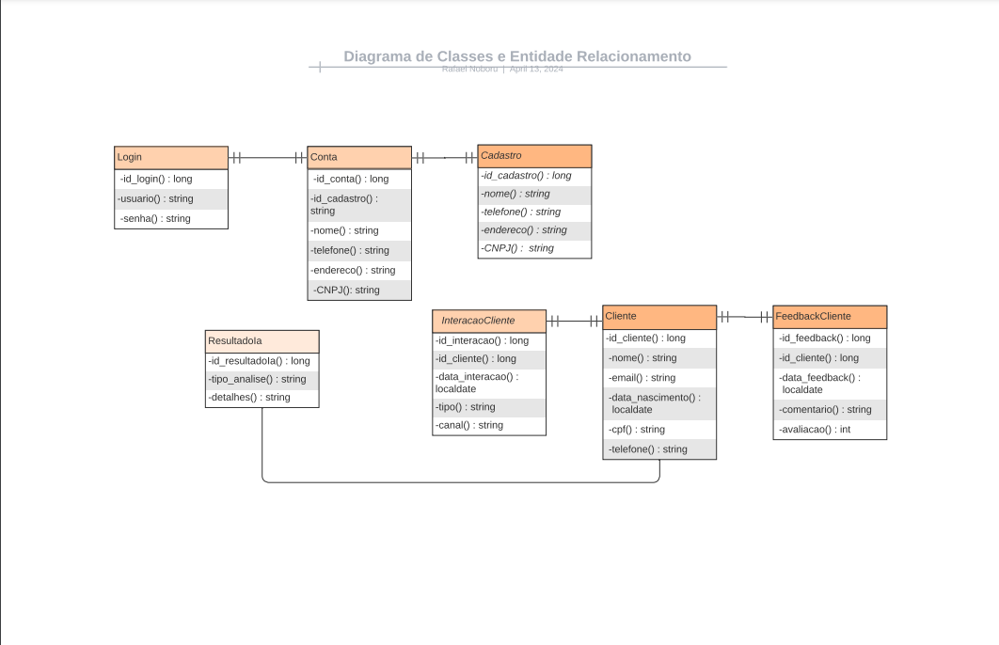

# IaFuture

API do projeto IaFuture - Software que controla resultados de análises feitas por IA

# Representantes 

- Gabriel Ortiz Oliva Gil - RM: 98642 – 2TDSPK
- Rafael Noboru Watanabe Nasaha - RM:99948 – 2TDSPK
- João Pedro Kraide Máximo - RM:550974 – 2TDSPK
- Matheus de Andrade Ferreira - RM:99375 – 2TDSPK
- Larissa Pereira Biusse - RM:551062 - 2TDSPK

-> A atividade foi realizada pelo aluno Rafael Noboru dentro de um período de duas semanas, iniciado no dia 01/04/24.

# Como rodar a aplicação

- Tenha a extensão de Java instalada no programa Visual Studio Code, depois vá em alguma classe java e clique em "Run Java";
- Após isso digite o endereço "http://localhost:8080/h2-console" na barra do seu navegador para entrar no Banco de Dados H2;
- Em JDBC URL digite "jdbc:h2:mem:iafuture" e clique em Connect;
- Utilize o arquivo JSON disponibilizado na pasta dos documentos e execute no programa POSTMAN para conseguir executar o CRUD das classes.

# Objetivos da aplicação

- Cadastrar a empresa que vai precisar do nosso software, podendo ser qualquer tipo de empresa que busque através da IA, o crescimento de sua empresa;
- A empresa irá se cadastrar e fornecer alguns dados;
- Depois vamos recolher dados dos clientes que fazem uso do produto ou serviço fornecidos pela empresa que está fazendo uso do software;
- Esses dados servirão como dataset para utilizarmos as ferramentas da IA e de análise de dados para obtermos resultados que ajudem a empresa ter maior conhecimentos sobre seus consumidores.

-> Link do video explicando: https://www.youtube.com/watch?v=KdMg60ojUrA

# Diagramas



# Tarefas

- [] CRUD de Cadastros
- [] CRUD de Clientes
- [] CRUD de Contas
- [] CRUD de Feedbacks
- [] CRUD de Interações
- [] CRUD de Logins
- [] CRUD de Resultados
- [] Dashboard

## Documentação da API

### Endpoints

- [Listar todos os Cadastros](#listar-todos-os-cadastros)
- [Efetuar Cadastro](#efetuar-cadastro)
- [Detalhes do Cadastro](#detalhes-do-cadastro)
- [Apagar Cadastro](#apagar-cadastro)
- [Atualizar Cadastro](#atualizar-cadastro)
---
- [Listar todos os Clientes](#listar-todos-os-clientes)
- [Cadastrar Clientes](#cadastrar-cliente)
- [Detalhes do Clientes](#detalhes-do-cliente)
- [Apagar Clientes](#apagar-cliente)
- [Atualizar Clientes](#atualizar-cliente)
---
- [Listar todas as Contas](#listar-todas-as-contas)
- [Cadastrar Contas](#cadastrar-conta)
- [Detalhes da Conta](#detalhes-da-conta)
- [Apagar Conta](#apagar-conta)
- [Atualizar Conta](#atualizar-conta)
---
- [Listar todos os Feedbacks ](#listar-todos-os-feedbacks)
- [Cadastrar Feedback ](#cadastrar-feedback)
- [Detalhes do Feedback ](#detalhes-do-feedback)
- [Apagar Feedback ](#apagar-feedback)
- [Atualizar Feedback ](#atualizar-feedback)
---
- [Listar todos as Interações ](#listar-todas-as-interações)
- [Cadastrar Interações ](#cadastrar-interação)
- [Detalhes da Interação ](#detalhes-da-interação)
- [Apagar Interação ](#apagar-interação)
- [Atualizar Interação ](#atualizar-interação)
---
- [Listar todos os Logins ](#listar-todos-os-logins)
- [Efetuar Login ](#cadastrar-login)
- [Detalhes do Login ](#detalhes-do-login)
- [Apagar Login ](#apagar-login)
- [Atualizar Login ](#atualizar-login)
---
- [Listar todos os Resultados ](#listar-todos-os-resultados)
- [Cadastrar Resultado ](#cadastrar-resultado)
- [Detalhes do Resultado ](#detalhes-do-resultado)
- [Apagar Resultado ](#apagar-resultado)
- [Atualizar Resultado ](#atualizar-resultado)
---

### Listar todos os Cadastros

`GET` /cadastro

Retorna um array com todos os cadastros realizados.

- Exemplo de resposta

```js
[
    {
        "id_cadastro": 1,
        "nome": "Empresa x",
        "telefone": "1197124-9076",
        "endereco": "Rua X",
        "cnpj": "4823982183291"
    }
]
```

- Código de status

|código|descrição|
|------|---------|
|200|Os dados dos cadastros foram retornados com sucesso
|401|Acesso negado. Você deve se autenticar

### Efetuar Cadastro

`POST` /cadastro

Cria um novo cadastro com os dados enviados no corpo da requisição

- Corpo da Requisição

|campo|tipo|obrigatório|descrição|
|-----|----|:-----------:|---------|
|nome|string|✅|O nome da empresa.
|telefone|string|✅|O telefone celular com DDD de quem irá se cadastrar.
|endereco|string|✅|O endereço de quem irá se cadastrar.
|Cnpj|string|✅|O CNPJ da empresa que irá se cadastrar.

```js
[
    {
        "nome": "Empresa x",
        "telefone": "1197124-9076",
        "endereco": "Rua X",
        "cnpj": "4823982183291"
    }
]
```

- Exemplo de resposta

```js
[
    {
        "id_cadastro": 1,
        "nome": "Empresa x",
        "telefone": "1197124-9076",
        "endereco": "Rua X",
        "cnpj": "4823982183291"
    }
]
```

- Código de Status

|código|descrição|
|------|---------|
|201|Cadastro efetuado com sucesso
|400|Dados enviados são inválidos. Verifique o corpo da requisição
|401|Acesso negado. Você deve se autenticar

### Detalhes do Cadastro

`GET` /cadastro/`{id}`

Retorna os detalhes do cadastro através do `id` informado como parâmetro de path.

- Exemplo de resposta

```js
[
    {
        "id_cadastro": 1,
        "nome": "Empresa x",
        "telefone": "1197124-9076",
        "endereco": "Rua X",
        "cnpj": "4823982183291"
    }
]
```

- Código de Status

|código|descrição|
|------|---------|
|200|Os dados do cadastro foram retornados com sucesso
|401|Acesso negado. Você deve se autenticar
|404|Não existe cadastro com o `id` informado

### Apagar Cadastro

`DELETE` /cadastro/`{id}`

Apaga o cadastro com o `id` especificado no parâmetro de path.

- Código de Status

|código|descrição|
|------|---------|
|204|Cadastro foi apagado com sucesso
|401|Acesso negado. Você deve se autenticar
|404|Não existe cadastro com o `id` informado

### Atualizar Cadastro

`PUT` /cadastro/`{id}`

Altera os dados do cadastro especificado no `id`, utilizando as informações enviadas no corpo da requisição.

- Corpo da Requisição

|campo|tipo|obrigatório|descrição|
|-----|----|:-----------:|---------|
|nome|string|✅|O nome completo da empresa.
|telefone|string|✅|O telefone celular com DDD de quem irá se cadastrar.
|endereco|string|✅|O endereço de quem irá se cadastrar.
|cnpj|string|✅|O CNPJ da empresa que irá se cadastrar.

```js
[
    {
        "nome": "Empresa x",
        "telefone": "1197124-9076",
        "endereco": "Rua X",
        "cnpj": "4823982183291"
    }
]
```

- Exemplo de Resposta

```js
[
    {
        "id_cadastro": 1,
        "nome": "Empresa x",
        "telefone": "1197124-9076",
        "endereco": "Rua X",
        "cnpj": "4823982183291"
    }
]
```

- Código de Status

|código|descrição|
|------|---------|
|200|Cadastro alterado com sucesso
|400|Dados enviados são inválidos. Verifique o corpo da requisição
|401|Acesso negado. Você deve se autenticar
|404|Não existe cadastro com o `id` informado

---

### Listar todos os Clientes

`GET` /cliente

Retorna um array com todos os clientes cadastrados.

- Exemplo de resposta

```js
[
    {
        "id_cliente": 1,
        "nome": "Rafael",
        "email": "rafael@gmail.com",
        "data_nascimento": "1998-11-20",
        "cpf": "835.711.810-00",
        "telefone": "1197867-2345"
    }
]
```

- Código de status

|código|descrição|
|------|---------|
|200|Os dados dos cadastros foram retornados com sucesso
|401|Acesso negado. Você deve se autenticar

### Cadastrar Cliente

`POST` /cliente

Cadastra um novo cliente com os dados enviados no corpo da requisição

- Corpo da Requisição

|campo|tipo|obrigatório|descrição|
|-----|----|:-----------:|---------|
|nome|string|✅|O nome completo de cliente da empresa.
|email|string|✅|O email do cliente.
|data_nascimento|localdate|✅|A data de nascimento do cliente.
|cpf|string|✅|O cpf do cliente.
|telefone|string|✅|O telefone celular com DDD do cliente.

```js
[
    {
        "nome": "Rafael",
        "email": "rafael@gmail.com",
        "data_nascimento": "1998-11-20",
        "cpf": "835.711.810-00",
        "telefone": "1197867-2345"
    }
]
```

- Exemplo de resposta

```js
[
    {
        "id_cliente": 1,
        "nome": "Rafael",
        "email": "rafael@gmail.com",
        "data_nascimento": "1998-11-20",
        "cpf": "835.711.810-00",
        "telefone": "1197867-2345"
    }
]
```

- Código de Status

|código|descrição|
|------|---------|
|201|Cliente cadastrado com sucesso
|400|Dados enviados são inválidos. Verifique o corpo da requisição
|401|Acesso negado. Você deve se autenticar

### Detalhes do Cliente

`GET` /cliente/`{id}`

Retorna os detalhes do cliente através do `id` informado como parâmetro de path.

- Exemplo de resposta

```js
[
    {
        "id_cliente": 1,
        "nome": "Rafael",
        "email": "rafael@gmail.com",
        "data_nascimento": "1998-11-20",
        "cpf": "835.711.810-00",
        "telefone": "1197867-2345"
    }
]
```

- Código de Status

|código|descrição|
|------|---------|
|200|Os dados do cliente foram retornados com sucesso
|401|Acesso negado. Você deve se autenticar
|404|Não existe cadastro do cliente com o `id` informado

### Apagar Cliente

`DELETE` /cliente/`{id}`

Apaga os dados do cliente com o `id` especificado no parâmetro de path.

- Código de Status

|código|descrição|
|------|---------|
|204|Cadastro do cliente foi apagado com sucesso
|401|Acesso negado. Você deve se autenticar
|404|Não existe cadastro do cliente com o `id` informado

### Atualizar Cliente

`PUT` /cliente/`{id}`

Altera os dados cadastrados do cliente especificado no `id`, utilizando as informações enviadas no corpo da requisição.

- Corpo da Requisição

|campo|tipo|obrigatório|descrição|
|-----|----|:-----------:|---------|
|nome|string|✅|O nome completo de quem irá se cadastrar.
|email|string|✅|O email do cliente.
|data_nascimento|string|✅|A data de nascimento do cliente.
|cpf|string|✅|O cpf do cliente.
|telefone|string|✅|O telefone celular com DDD do cliente.

```js
[
    {
        "nome": "Rafael",
        "email": "rafael@gmail.com",
        "data_nascimento": "1998-11-20",
        "cpf": "835.711.810-00",
        "telefone": "1197867-2345"
    }
]
```

- Exemplo de Resposta

```js
[
    {
        "id_cliente": 1,
        "nome": "Rafael",
        "email": "rafael@gmail.com",
        "data_nascimento": "1998-11-20",
        "cpf": "835.711.810-00",
        "telefone": "1197867-2345"
    }
]
```

- Código de Status

|código|descrição|
|------|---------|
|200|Cadastro do cliente alterado com sucesso
|400|Dados enviados são inválidos. Verifique o corpo da requisição
|401|Acesso negado. Você deve se autenticar
|404|Não existe cadastro do cliente com o `id` informado

---

### Listar todas as Contas

`GET` /conta

Retorna um array com todas as contas cadastrados.

- Exemplo de resposta

```js
[
    {
	    "nome": "Rafael",
        "id_cadastro": 1,
        "telefone": "1197124-9076",
        "endereco": "Rua X",
        "cnpj": "4823982183291"
    }   
]
```

- Código de status

|código|descrição|
|------|---------|
|200|Os dados das contas foram retornados com sucesso
|401|Acesso negado. Você deve se autenticar

### Cadastrar Conta

`POST` /conta

Cadastra uma nova conta com os dados enviados no corpo da requisição

- Corpo da Requisição

|campo|tipo|obrigatório|descrição|
|-----|----|:-----------:|---------|
|nome|string|✅|O nome da empresa cadastrada.
|id_cadastro|long|✅|O id do cadastro realizado pela empresa.
|telefone|string|✅|O telefone de contato com DDD da empresa cadastrada.
|endereco|string|✅|O endereço da empresa cadastrada.
|cnpj|string|✅|O cnpj da empresa cadastrada.

```js
[
    {
	    "nome": "Rafael",
        "id_cadastro": 1,
        "telefone": "1197124-9076",
        "endereco": "Rua X",
        "cnpj": "4823982183291"
    }   
]
```

- Exemplo de resposta

```js
[
    {
        "id_conta": 1,
        "id_cadastro": 1,
        "nome": "Rafael",
        "telefone": "1197124-9076",
        "endereco": "Rua X",
        "cnpj": "4823982183291"
    }
]
```

- Código de Status

|código|descrição|
|------|---------|
|201|Conta cadastrada com sucesso
|400|Dados enviados são inválidos. Verifique o corpo da requisição
|401|Acesso negado. Você deve se autenticar

### Detalhes da Conta

`GET` /conta/`{id}`

Retorna os detalhes da conta através do `id` informado como parâmetro de path.

- Exemplo de resposta

```js
[
    {
        "id_conta": 1,
        "id_cadastro": 1,
        "nome": "Rafael",
        "telefone": "1197124-9076",
        "endereco": "Rua X",
        "cnpj": "4823982183291"
    }
]
```

- Código de Status

|código|descrição|
|------|---------|
|200|Os dados da conta foram retornados com sucesso
|401|Acesso negado. Você deve se autenticar
|404|Não existe conta com o `id` informado

### Apagar Conta

`DELETE` /conta/`{id}`

Apaga os dados da conta com o `id` especificado no parâmetro de path.

- Código de Status

|código|descrição|
|------|---------|
|204|Conta foi apagada com sucesso
|401|Acesso negado. Você deve se autenticar
|404|Não existe conta com o `id` informado

### Atualizar Conta

`PUT` /conta/`{id}`

Altera os dados cadastrados do conta especificado no `id`, utilizando as informações enviadas no corpo da requisição.

- Corpo da Requisição

|campo|tipo|obrigatório|descrição|
|-----|----|:-----------:|---------|
|nome|string|✅|O nome da empresa cadastrada.
|id_cadastro|long|✅|O id do cadastro realizado pela empresa.
|telefone|string|✅|O telefone de contato com DDD da empresa cadastrada.
|endereco|string|✅|O endereço da empresa cadastrada.
|cnpj|string|✅|O cnpj da empresa cadastrada.

```js
[
    {
        "id_cadastro": 1,
        "nome": "Rafael",
        "telefone": "1197124-9076",
        "endereco": "Rua X",
        "cnpj": "4823982183291"
    }
]
```

- Exemplo de Resposta

```js
[
    {
        "id_conta": 1,
        "id_cadastro": 1,
        "nome": "Rafael",
        "telefone": "1197124-9076",
        "endereco": "Rua X",
        "cnpj": "4823982183291"
    }
]
```

- Código de Status

|código|descrição|
|------|---------|
|200|Cadastro da conta alterada com sucesso
|400|Dados enviados são inválidos. Verifique o corpo da requisição
|401|Acesso negado. Você deve se autenticar
|404|Não existe conta com o `id` informado

---

### Listar todos os Feedbacks

`GET` /feedbackcliente

Retorna um array com todos os feedbacks cadastrados.

- Exemplo de resposta

```js
[
    {
        "id_feedback": 1,
        "id_cliente": 123,
        "data_feedback": "2024-04-13",
        "comentario": "Excelente atendimento! Profissionais muito competentes.",
        "avaliacao": 5
    }
]
```

- Código de status

|código|descrição|
|------|---------|
|200|Os dados dos feedbacks foram retornados com sucesso
|401|Acesso negado. Você deve se autenticar

### Cadastrar Feedback

`POST` /feedbackcliente

Cadastra um novo feedback com os dados enviados no corpo da requisição

- Corpo da Requisição

|campo|tipo|obrigatório|descrição|
|-----|----|:-----------:|---------|
|id_cliente|long|✅|O id do cliente cadastrado.
|data_feedback|localdate|✅|A data do cadastro do feedback.
|comentario|string|✅|A parte escrita do feedback.
|avaliacao|int|✅|A nota do serviço prestado pela empresa.

```js
[
    {
        "id_cliente": 123,
        "data_feedback": "2024-04-13",
        "comentario": "Excelente atendimento! Profissionais muito competentes.",
        "avaliacao": 5
    }
]
```

- Exemplo de resposta

```js
[
    {
        "id_feedback": 1,
        "id_cliente": 123,
        "data_feedback": "2024-04-13",
        "comentario": "Excelente atendimento! Profissionais muito competentes.",
        "avaliacao": 5
    }
]
```

- Código de Status

|código|descrição|
|------|---------|
|201|Feedback cadastrado com sucesso
|400|Dados enviados são inválidos. Verifique o corpo da requisição
|401|Acesso negado. Você deve se autenticar

### Detalhes do Feedback

`GET` /feedbackcliente/`{id}`

Retorna os detalhes do feedback através do `id` informado como parâmetro de path.

- Exemplo de resposta

```js
[
    {
        "id_feedback": 1,
        "id_cliente": 123,
        "data_feedback": "2024-04-13",
        "comentario": "Excelente atendimento! Profissionais muito competentes.",
        "avaliacao": 5
    }
]
```

- Código de Status

|código|descrição|
|------|---------|
|200|Os dados do feedback foram retornados com sucesso
|401|Acesso negado. Você deve se autenticar
|404|Não existe feedback com o `id` informado

### Apagar Feedback

`DELETE` /feedbackcliente/`{id}`

Apaga os dados do feedback com o `id` especificado no parâmetro de path.

- Código de Status

|código|descrição|
|------|---------|
|204|Feedback foi apagado com sucesso
|401|Acesso negado. Você deve se autenticar
|404|Não existe feedback com o `id` informado

### Atualizar Feedback

`PUT` /feedbackcliente/`{id}`

Altera os dados cadastrados do feedback especificado no `id`, utilizando as informações enviadas no corpo da requisição.

- Corpo da Requisição

|campo|tipo|obrigatório|descrição|
|-----|----|:-----------:|---------|
|id_cliente|long|✅|O id do cliente cadastrado.
|data_feedback|localdate|✅|A data do cadastro do feedback.
|comentario|string|✅|A parte escrita do feedback.
|avaliacao|int|✅|A nota do serviço prestado pela empresa.

```js
[
    {
        "id_cliente": 123,
        "data_feedback": "2024-04-13",
        "comentario": "Excelente atendimento! Profissionais muito competentes.",
        "avaliacao": 5
    }
]
```

- Exemplo de Resposta

```js
[
    {
        "id_feedback": 1,
        "id_cliente": 123,
        "data_feedback": "2024-04-13",
        "comentario": "Excelente atendimento! Profissionais muito competentes.",
        "avaliacao": 5
    }
]
```

- Código de Status

|código|descrição|
|------|---------|
|200|Cadastro do feedback alterado com sucesso
|400|Dados enviados são inválidos. Verifique o corpo da requisição
|401|Acesso negado. Você deve se autenticar
|404|Não existe feedback com o `id` informado

---

### Listar todas as Interações

`GET` /interacaocliente

Retorna um array com todas interações cadastradas.

- Exemplo de resposta

```js
[
    {
        "id_interacao": 1,
        "id_cliente": 123,
        "data_interacao": "2024-04-13",
        "tipo": "visita_site",
        "canal": "facebook"
    }
]
```

- Código de status

|código|descrição|
|------|---------|
|200|Os dados das interações foram retornadas com sucesso
|401|Acesso negado. Você deve se autenticar

### Cadastrar Interação

`POST` /interacaocliente

Cadastra uma nova interação com os dados enviados no corpo da requisição

- Corpo da Requisição

|campo|tipo|obrigatório|descrição|
|-----|----|:-----------:|---------|
|id_cliente|long|✅|O id do cliente.
|data_interacao|localdate|✅|A data da interação.
|tipo|string|✅|O tipo da interação, deve ser visita_site, interacao_social, compra_site, envio_email, clique_anuncio.
|canal|int|✅|O canal, deve ser facebook, instagram, twitter, site, email.

```js
[
    {
        "id_cliente": 123,
        "data_interacao": "2024-04-13",
        "tipo": "visita_site",
        "canal": "facebook"
    }
]
```

- Exemplo de resposta

```js
[
    {
        "id_interacao": 1,
        "id_cliente": 123,
        "data_interacao": "2024-04-13",
        "tipo": "visita_site",
        "canal": "facebook"
    }
]
```

- Código de Status

|código|descrição|
|------|---------|
|201|Interação cadastrada com sucesso
|400|Dados enviados são inválidos. Verifique o corpo da requisição
|401|Acesso negado. Você deve se autenticar

### Detalhes da Interação

`GET` /interacaocliente/`{id}`

Retorna os detalhes da interação através do `id` informado como parâmetro de path.

- Exemplo de resposta

```js
[
    {
        "id_interacao": 1,
        "id_cliente": 123,
        "data_interacao": "2024-04-13",
        "tipo": "visita_site",
        "canal": "facebook"
    }
]
```

- Código de Status

|código|descrição|
|------|---------|
|200|Os dados da interação foram retornados com sucesso
|401|Acesso negado. Você deve se autenticar
|404|Não existe interação com o `id` informado

### Apagar Interação

`DELETE` /interacaocliente/`{id}`

Apaga os dados da interaçãos com o `id` especificado no parâmetro de path.

- Código de Status

|código|descrição|
|------|---------|
|204|Interação foi apagada com sucesso
|401|Acesso negado. Você deve se autenticar
|404|Não existe interação com o `id` informado

### Atualizar Interação

`PUT` /interacaocliente/`{id}`

Altera os dados cadastrados da interação especificado no `id`, utilizando as informações enviadas no corpo da requisição.

- Corpo da Requisição

|campo|tipo|obrigatório|descrição|
|-----|----|:-----------:|---------|
|id_cliente|long|✅|O id do cliente.
|data_interacao|localdate|✅|A data da interação.
|tipo|string|✅|O tipo da interação, deve ser visita_site, interacao_social, compra_site, envio_email, clique_anuncio.
|canal|int|✅|O canal, deve ser facebook, instagram, twitter, site, email.

```js
[
    {
        "id_cliente": 123,
        "data_interacao": "2024-04-13",
        "tipo": "visita_site",
        "canal": "facebook"
    }
]
```

- Exemplo de Resposta

```js
[
    {
        "id_interacao": 1,
        "id_cliente": 123,
        "data_interacao": "2024-04-13",
        "tipo": "visita_site",
        "canal": "facebook"
    }
]
```

- Código de Status

|código|descrição|
|------|---------|
|200|Cadastro da interação alterada com sucesso
|400|Dados enviados são inválidos. Verifique o corpo da requisição
|401|Acesso negado. Você deve se autenticar
|404|Não existe interação com o `id` informado

---

### Listar todos os Logins

`GET` /login

Retorna um array com todos logins cadastrados.

- Exemplo de resposta

```js
[
    {
        "id_login": 1,
        "usuario": "exemplo_usuario",
        "senha": "senha123"
    }   
]
```

- Código de status

|código|descrição|
|------|---------|
|200|Os dados dos logins foram retornados com sucesso
|401|Acesso negado. Você deve se autenticar


### Cadastrar Login

`POST` /login

Cadastra um novo login com os dados enviados no corpo da requisição

- Corpo da Requisição

|campo|tipo|obrigatório|descrição|
|-----|----|:-----------:|---------|
|id_login|long|✅|O id do login.
|usuario|localdate|✅|O usuario criado.
|senha|string|✅|A senha criada pelo usuario.

```js
[
    {
        "usuario": "exemplo_usuario",
        "senha": "senha123"
    }   
]
```

- Exemplo de resposta

```js
[
    {
        "id_login": 1,
        "usuario": "exemplo_usuario",
        "senha": "senha123"
    }   
]
```

- Código de Status

|código|descrição|
|------|---------|
|201|Login cadastrado com sucesso
|400|Dados enviados são inválidos. Verifique o corpo da requisição
|401|Acesso negado. Você deve se autenticar

### Detalhes do Login

`GET` /login/`{id}`

Retorna os detalhes do login através do `id` informado como parâmetro de path.

- Exemplo de resposta

```js
[
    {
        "id_login": 1,
        "usuario": "exemplo_usuario",
        "senha": "senha123"
    }   
]
```

- Código de Status

|código|descrição|
|------|---------|
|200|Os dados do login foram retornados com sucesso
|401|Acesso negado. Você deve se autenticar
|404|Não existe login com o `id` informado

### Apagar Login

`DELETE` /login/`{id}`

Apaga os dados do login com o `id` especificado no parâmetro de path.

- Código de Status

|código|descrição|
|------|---------|
|204|Login foi apagado com sucesso
|401|Acesso negado. Você deve se autenticar
|404|Não existe login com o `id` informado

### Atualizar Login

`PUT` /login/`{id}`

Altera os dados cadastrados do login especificado no `id`, utilizando as informações enviadas no corpo da requisição.

- Corpo da Requisição

|campo|tipo|obrigatório|descrição|
|-----|----|:-----------:|---------|
|id_login|long|✅|O id do login.
|usuario|localdate|✅|O usuario criado.
|senha|string|✅|A senha criada pelo usuario.

```js
[
    {
        "usuario": "exemplo_usuario",
        "senha": "senha123"
    }   
]
```

- Exemplo de Resposta

```js
[
    {
        "id_login": 1,
        "usuario": "exemplo_usuario",
        "senha": "senha123"
    }   
]
```

- Código de Status

|código|descrição|
|------|---------|
|200|Login alterado com sucesso
|400|Dados enviados são inválidos. Verifique o corpo da requisição
|401|Acesso negado. Você deve se autenticar
|404|Não existe login com o `id` informado

---

### Listar todos os Resultados

`GET` /resultadoia

Retorna um array com todos resultados cadastrados.

- Exemplo de resposta

```js
[
    {
        "id_resultadoIa": 1,
        "tipo_analise": "análise classificatória usando algoritmo KNN",
        "detalhes": "Análise concluída com sucesso."
    } 
]
```

- Código de status

|código|descrição|
|------|---------|
|200|Os dados dos resultados foram retornados com sucesso
|401|Acesso negado. Você deve se autenticar

### Cadastrar Resultado

`POST` /resultadoia

Cadastra um novo resultado com os dados enviados no corpo da requisição

- Corpo da Requisição

|campo|tipo|obrigatório|descrição|
|-----|----|:-----------:|---------|
|id_resultadoIa|long|✅|O id do resultado.
|tipo_analise|string|✅|O tipo de análise que foi utilizado.
|detalhes|string|✅|Os detalhes das análises feitas pela IA.

```js
[
    {
        "tipo_analise": "análise classificatória usando algoritmo KNN",
        "detalhes": "Análise concluída com sucesso."
    } 
]
```

- Exemplo de resposta

```js
[
    {
        "id_resultadoIa": 1,
        "tipo_analise": "análise classificatória usando algoritmo KNN",
        "detalhes": "Análise concluída com sucesso."
    } 
]
```

- Código de Status

|código|descrição|
|------|---------|
|201|Resultado cadastrado com sucesso
|400|Dados enviados são inválidos. Verifique o corpo da requisição
|401|Acesso negado. Você deve se autenticar

### Detalhes do Resultado

`GET` /resultadoia/`{id}`

Retorna os detalhes do resultado através do `id` informado como parâmetro de path.

- Exemplo de resposta

```js
[
    {
        "id_resultadoIa": 1,
        "tipo_analise": "análise classificatória usando algoritmo KNN",
        "detalhes": "Análise concluída com sucesso."
    } 
]
```

- Código de Status

|código|descrição|
|------|---------|
|200|Os dados do resultado foram retornados com sucesso
|401|Acesso negado. Você deve se autenticar
|404|Não existe resultado com o `id` informado

### Apagar Resultado

`DELETE` /resultadoia/`{id}`

Apaga os dados do resultado com o `id` especificado no parâmetro de path.

- Código de Status

|código|descrição|
|------|---------|
|204|Resultado foi apagado com sucesso
|401|Acesso negado. Você deve se autenticar
|404|Não existe resultado com o `id` informado

### Atualizar Resultado

`PUT` /resultadoia/`{id}`

Altera os dados cadastrados do resultado especificado no `id`, utilizando as informações enviadas no corpo da requisição.

- Corpo da Requisição

|campo|tipo|obrigatório|descrição|
|-----|----|:-----------:|---------|
|id_login|long|✅|O id do login.
|usuario|localdate|✅|O usuario criado.
|senha|string|✅|A senha criada pelo usuario.

```js
[
    {
        "tipo_analise": "análise classificatória usando algoritmo KNN",
        "detalhes": "Análise concluída com sucesso."
    } 
]
```

- Exemplo de Resposta

```js
[
    {
        "id_resultadoIa": 1,
        "tipo_analise": "análise classificatória usando algoritmo KNN",
        "detalhes": "Análise concluída com sucesso."
    } 
]
```

- Código de Status

|código|descrição|
|------|---------|
|200|Resultado alterado com sucesso
|400|Dados enviados são inválidos. Verifique o corpo da requisição
|401|Acesso negado. Você deve se autenticar
|404|Não existe resultado com o `id` informado

---